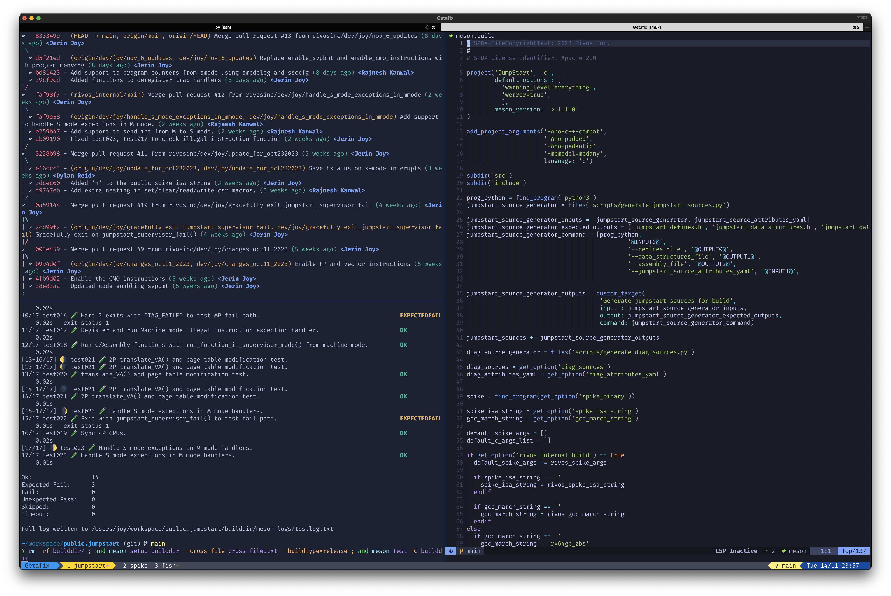

<!--
SPDX-FileCopyrightText: 2023 Jerin Joy

SPDX-License-Identifier: Apache-2.0
-->

# dotfiles

Installs my dev environment using [Dotbot](https://github.com/anishathalye/dotbot)



## Installation

```
./install
```

## Post Installation

### Set the fish theme

```
fish_config theme choose "TokyoNight Storm"
```

### Configure the tide prompt

```
tide configure
```

### Local overrides

Place machine-specific config in `~/local.config.fish` — it's sourced automatically if present.

The installer prompts for git name/email and writes `~/user.gitconfig` on first run.

## Tools

- **Shell:** [fish](https://fishshell.com) + [fisher](https://github.com/jorgebucaran/fisher) + [tide](https://github.com/IlanCosman/tide)
- **Editor:** [Neovim](https://neovim.io) with [lazy.nvim](https://github.com/folke/lazy.nvim)
- **Terminal multiplexer:** [tmux](https://github.com/tmux/tmux/wiki)
- **Theme:** [Tokyo Night](https://github.com/folke/tokyonight.nvim) across all tools
- **Packages:** [Homebrew](https://brew.sh) (macOS) / apt (Linux) — see [Brewfile](Brewfile) and [Aptfile](Aptfile)

## Troubleshooting

### Dotbot executable not found

```
git submodule deinit -f . && git submodule update --init --recursive
```

### Neovim plugin issues

```
rm -r ~/.local/state/nvim/
rm -r ~/.local/share/nvim/
```
