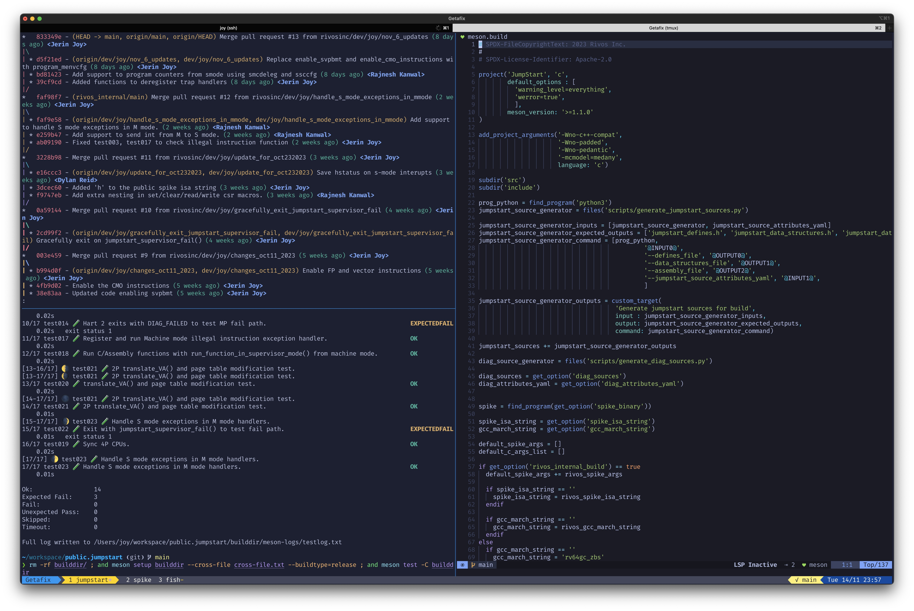

<!--
SPDX-FileCopyrightText: 2023 Jerin Joy

SPDX-License-Identifier: Apache-2.0
-->

# dotfiles

Installs my dev environment.

I use [`fish`](https://fishshell.com) as my default shell, [Neovim](https://neovim.io) as my editor in the terminal, and [`tmux`](https://github.com/tmux/tmux/wiki) as my terminal multiplexer.



See [`config.yaml`](config.yaml) to for the packages that will be installed.

## Installation

```
./setup_env.py
```

**Add `-f` to force**

Set up the "TokyoNight Storm" fish theme:

```
fish_config theme choose "TokyoNight Storm"
```

Configure the tide prompt:

```
tide configure
```

### Dry Run

See what changes will be made to your system before running the script.

## Dependencies

Install the `pyyaml` package. The setup script uses it to parse the `config.yaml` file.

```
pip3 install pyyaml
```
